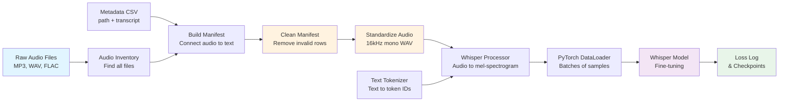

# 🎙️ Stardust: AI Audio Transcription and Translation System

## 📌 Quick Overview

**Stardust** is an end-to-end machine learning pipeline that:

- 🎤 Converts **audio → text (speech-to-text)** using OpenAI Whisper
- 🌐 Supports **multiple languages (English, Hindi)**
- 📊 Handles **large-scale audio datasets** with data engineering
- 🔧 Follows **enterprise-grade ML architecture**
- 🏦 Simulates a **banking-grade AI system** for:
  - Call center automation
  - Multilingual customer support
  - Voice-based assistants

**In one sentence:** *A supervised deep-learning pipeline that fine-tunes a pretrained Whisper model to map speech audio to text.*

---

## 🧠 Why This Project Matters

In real-world systems (e.g., banks, fintech companies), AI pipelines must:

* Handle **large, messy datasets** (different audio formats, encodings, nested folders)
* Be **scalable and modular** (each stage independent and reusable)
* Support **multiple languages** (not just English)
* Ensure **data quality and reproducibility** (clean data = better models)
* Be **easy to debug and extend** (enterprise-grade code quality)

This project demonstrates building that **foundation correctly**.

---

## 🚀 Quick Start Guide (5 Minutes)

### Prerequisites

Verify you have these installed:

```bash
python --version        # Should be 3.8+
git --version           # Any recent version
pip --version           # Should be installed with Python
```

**For Windows:** Use **Git Bash** (comes with Git installation)

### System Requirements

- **RAM**: Minimum 8GB (16GB recommended)
- **Storage**: 10GB+ (for audio data and models)
- **GPU**: Optional but recommended (CUDA-compatible for 5-10x speedup)

---

## 📦 Installation Steps (Git Bash)

### Step 1: Open Git Bash and Navigate to Project

```bash
cd /c/Users/niraj/VSCode/Stardust
```

**Expected output:**
```
niraj@computer MINGW64 /c/Users/niraj/VSCode/Stardust
$ pwd
/c/Users/niraj/VSCode/Stardust
```

**Explanation:**
- `cd` = change directory
- `/c/Users/niraj/VSCode/Stardust` = path to project (C: drive → /c/)
- `pwd` = print working directory (verifies you're in the right place)

---

### Step 2: Create a Python Virtual Environment

```bash
python -m venv stardust_env
```

**Expected output:**
```
(command runs silently for a few seconds)
(creates a new folder: stardust_env/)
```

**Explanation:**
- Virtual environment = isolated Python workspace for this project
- Prevents dependency conflicts with other projects
- `stardust_env/` folder contains all project-specific packages

**Why do this?** Each project can have different versions of libraries. Virtual environments keep them separate.

---

### Step 3: Activate the Virtual Environment

**For Git Bash (Windows):**
```bash
source stardust_env/Scripts/activate
```

**For PowerShell (Windows):**
```powershell
.\stardust_env\Scripts\Activate.ps1
```

**Expected output (Git Bash):**
```
(stardust_env) niraj@computer MINGW64 /c/Users/niraj/VSCode/Stardust
$
```

**Explanation:**
- `(stardust_env)` prefix = environment is ACTIVE ✓
- All python commands now use this environment's packages
- Deactivate later with: `deactivate`

---

### Step 4: Install Required Dependencies

```bash
pip install -r requirements.txt
```

**Expected output:**
```
Collecting pandas
  Downloading pandas-2.0.0-cp310-cp310-win_amd64.whl (11.4 MB)
    |████████████████████████████████| 11.4 MB 1.2 MB/s
Collecting numpy
  Downloading numpy-1.24.0-cp310-cp310-win_amd64.whl (14.5 MB)
    |████████████████████████████████| 14.5 MB 2.1 MB/s
...
Successfully installed pandas-2.0.0 numpy-1.24.0 tqdm-4.65.0 librosa-0.10.0 soundfile-0.12.1 torch-2.0.0 transformers-4.30.0 fastapi-0.104.0 uvicorn-0.24.0 pytest-7.4.0

(Total installation time: 5-15 minutes depending on internet speed)
```

**Explanation:**
- `pip install` = Python package installer
- `-r requirements.txt` = install all packages listed in requirements.txt
- **Key packages installed:**
  - `torch` = PyTorch (deep learning framework)
  - `transformers` = Hugging Face (includes OpenAI Whisper)
  - `librosa` = audio processing
  - `soundfile` = audio file I/O
  - `pandas`, `numpy`, `tqdm` = data processing and progress bars

**Troubleshooting:**
- If installation fails, try: `pip install --upgrade pip`
- For GPU support (CUDA), see [PyTorch Installation Guide](https://pytorch.org/get-started/locally/)

---

### Step 5: Verify Installation

Test that all packages work correctly:

```bash
python -c "import torch; import transformers; import librosa; print('✓ All dependencies installed successfully!')"
```

**Expected output:**
```
✓ All dependencies installed successfully!
```

**Explanation:**
- This command imports three key packages and prints a success message
- If you see an error, one package installation failed (see Troubleshooting section below)

---

## 🔄 Complete Pipeline: Step-by-Step Commands

The Stardust pipeline has 7 stages. Below is how to run each one with expected outputs and explanations:

### 📋 Pipeline Overview

```
Raw Audio Files
    ↓
Inventory Discovery
    ↓
Build Training Manifest
    ↓
Clean the Manifest
    ↓
Standardize Audio (mono, 16kHz, WAV)
    ↓
Test Dataset Loading
    ↓
Test Feature Dataset
    ↓
Train Whisper Model
```

---

### Stage 1️⃣: Create Audio Inventory (Optional - Data Discovery)

**Purpose:** Discover all audio files in your data folder

```bash
python -m src.ingestion.data_loader
```

**What happens:**
1. Scans `data/interim/<language>/` recursively
2. Finds all audio files (MP3, WAV, FLAC, M4A)
3. Creates a CSV index file in `data/metadata/`

**Expected output:**
```
Scanning: data/interim/english/
Found 100 audio files
Scanning: data/interim/hindi/
Found 85 audio files
Creating inventory file: data/metadata/english_audio_inventory.csv
Creating inventory file: data/metadata/hindi_audio_inventory.csv
✓ Inventory creation complete
```

**Output files created:**
- `data/metadata/english_audio_inventory.csv` - List of all English audio files
- `data/metadata/hindi_audio_inventory.csv` - List of all Hindi audio files

**How to understand:**
- If no files found → Check if `data/interim/` has audio files
- Count shows total discoverable audio files

---

### Stage 2️⃣: Build Training Manifest

**Purpose:** Connect audio files with their transcripts (the main training dataset)

```bash
python -m src.preprocessing.training_manifest
```

**What happens:**
1. Reads metadata CSV/TSV files from your data
2. Matches audio files with their transcripts
3. Creates a manifest CSV with columns: `audio_path`, `transcript`, `language`, `split`

**Expected output:**
```
Building manifest for English...
Processing 100 audio files...
✓ Manifest created: data/processed/english/manifest.csv (100 rows)

Building manifest for Hindi...
Processing 85 audio files...
✓ Manifest created: data/processed/hindi/manifest.csv (85 rows)
```

**Output files created:**
- `data/processed/english/manifest.csv`
- `data/processed/hindi/manifest.csv`

**CSV Structure (preview):**
```
audio_path,transcript,language,split
data/standardized/english/sample_001.wav,"Hello world",en,train
data/standardized/english/sample_002.wav,"How are you",en,train
data/standardized/english/sample_003.wav,"Thank you very much",en,dev
```

**How to understand:**
- If 0 rows created → Audio files or metadata not found in expected locations
- Splits show distribution: train (80%) vs dev (20%) for validation

---

### Stage 3️⃣: Clean the Manifest

**Purpose:** Remove invalid entries (missing files, empty transcripts, duplicates)

```bash
python -m src.preprocessing.preprocess_manifest
```

**What happens:**
1. Validates that audio files actually exist
2. Removes rows with blank transcripts
3. Removes duplicate entries
4. Creates a clean manifest for training

**Expected output:**
```
Processing English manifest...
Original rows: 100
  - Removed: missing audio files: 5
  - Removed: blank transcripts: 2
  - Removed: duplicates: 2
  - Removed: short transcripts: 3
✓ Clean manifest saved: data/processed/english/manifest_clean.csv (86 rows)

Processing Hindi manifest...
Original rows: 85
  - Removed: missing audio files: 3
  - Removed: blank transcripts: 1
  - Removed: duplicates: 1
✓ Clean manifest saved: data/processed/hindi/manifest_clean.csv (80 rows)
```

**Output files created:**
- `data/processed/english/manifest_clean.csv` (86 rows)
- `data/processed/hindi/manifest_clean.csv` (80 rows)

**How to understand:**
- "Removed: X" = rows deleted for data quality
- Compare original vs final row count: Lower is more strict quality
- If "Removed" is very high → Your source data needs cleaning

---

### Stage 4️⃣: Standardize Audio

**Purpose:** Convert all audio to standard format (16kHz mono WAV) - **Required for Whisper**

```bash
python -m src.preprocessing.audio_standardizer
```

**What happens:**
1. Reads audio files in any format (MP3, FLAC, M4A, WAV)
2. Converts to WAV format
3. Resamples to 16kHz (Whisper standard)
4. Converts to mono (single channel)
5. Saves standardized audio

**Expected output:**
```
Standardizing English audio...
Processing file 1/86: sample_001.mp3 -> sample_001.wav
  Original: 44100 Hz, stereo → Standardized: 16000 Hz, mono
Processing file 2/86: sample_002.flac -> sample_002.wav
  Original: 48000 Hz, mono → Standardized: 16000 Hz, mono
...
Processing file 86/86: sample_086.wav -> sample_086.wav
  Original: 16000 Hz, mono → Standardized: 16000 Hz, mono (no change)

✓ Audio standardization complete (English)
  - Total files processed: 86
  - Total audio duration: 2 hours 45 minutes
  - Storage used: 850 MB
  - Failed conversions: 0

Standardizing Hindi audio...
...
✓ Audio standardization complete (Hindi)
  - Total files processed: 80
  - Total audio duration: 2 hours 10 minutes
  - Storage used: 720 MB
  - Failed conversions: 0
```

**Output files created:**
- `data/standardized/english/train/*.wav` - All English training audio
- `data/standardized/english/dev/*.wav` - All English validation audio
- `data/standardized/hindi/train/*.wav` - All Hindi training audio
- `data/standardized/hindi/dev/*.wav` - All Hindi validation audio
- `data/processed/english/manifest_standardized.csv` - Updated manifest with new paths
- `data/processed/hindi/manifest_standardized.csv` - Updated manifest with new paths

**How to understand:**
- "Original: 44100 Hz, stereo" → Your audio properties BEFORE standardization
- "Standardized: 16000 Hz, mono" → Always the target
- If "Failed conversions > 0" → Some audio files couldn't be processed (corrupted?)
- Storage increases: Original MP3 files were compressed; WAV is uncompressed

---

### Stage 5️⃣: Test Dataset Loader

**Purpose:** Verify that data loads correctly before training

```bash
python -m src.training.test_dataset_loader
```

**What happens:**
1. Loads the standardized manifest
2. Attempts to load sample audio files
3. Verifies transcripts are readable
4. Creates test batches

**Expected output:**
```
Loading English training dataset...
✓ Dataset loaded successfully
  - Total samples: 86
  - Train split: 69 samples
  - Dev split: 17 samples

Loading sample batch (batch_size=2)...
✓ Batch loaded successfully
  - Sample 1:
    * Audio file: data/standardized/english/train/sample_001.wav
    * Audio shape: (16000,) = 1 second at 16kHz
    * Transcript: "Hello this is a test" (45 characters)
    * Language: en
  - Sample 2:
    * Audio file: data/standardized/english/train/sample_002.wav
    * Audio shape: (16000,) = 1 second at 16kHz
    * Transcript: "How are you doing today" (52 characters)
    * Language: en

✓ Dataset loader test PASSED!
```

**How to understand:**
- Audio shape `(16000,)` = 1 second of audio at 16kHz sample rate
- If samples are much larger (e.g., `(160000,)`) = 10 seconds
- If audio files can't load → Check if standardization completed
- Transcript length = number of characters in text

---

### Stage 6️⃣: Test Feature Dataset (Whisper Format)

**Purpose:** Verify data is properly converted to Whisper tensor format

```bash
python -m src.training.test_feature_dataset
```

**What happens:**
1. Loads the Whisper processor (converts speech → mel-spectrograms)
2. Loads the text tokenizer
3. Creates sample batches in Whisper-ready format
4. Tests batching with padding

**Expected output:**
```
Loading Whisper processor (openai/whisper-small)...
✓ Processor loaded successfully

Loading Whisper tokenizer...
✓ Tokenizer loaded successfully

Testing feature dataset...
✓ Feature dataset created
  - Total samples: 86
  - Language: en
  - Task: transcribe

Creating test batch (batch_size=2)...
✓ Batch 1 created successfully:

  Input Features (Mel-Spectrogram):
    - Shape: torch.Size([2, 3000, 128])
      (2 samples, 3000 time steps, 128 mel-frequency bins)
    - Min value: -8.456
    - Max value: 4.234
    - Data type: float32

  Labels (Tokenized Text):
    - Shape: torch.Size([2, 50])
      (2 samples, max 50 tokens per sample)
    - Token 1: [50258, 50259, 1234, 5678, ...]
    - Token 2: [50258, 50259, 2341, 6789, ...]

  Decoder Start Tokens:
    - Value: [50258, 50258]
    - (Special Whisper token for transcription task)

✓ Feature dataset test PASSED!
```

**How to understand:**
- Mel-Spectrogram = visual representation of audio (frequency over time)
- Shape `[2, 3000, 128]` = (batch_size, time_steps, frequency_bins)
- Tokens = numeric representation of text (each word/character = number)
- If batch fails → Mismatch between audio and text lengths

---

### Stage 7️⃣: Run Model Training

**Purpose:** Fine-tune OpenAI Whisper on your data

```bash
python -m src.training.train_whisper
```

**What happens:**
1. Loads the Whisper model from Hugging Face
2. Creates data loaders for training and validation
3. Runs training loop (forward pass, loss calculation, backpropagation)
4. Saves checkpoints and logs metrics

**Expected output:**
```
train_whisper.py started
Using device: cuda (GPU enabled - fast!)
         (or: cpu - slower, but works)

Loading Whisper model: openai/whisper-small
  Model size: 244M parameters
  Downloaded from Hugging Face

Loading dataset...
✓ Dataset loaded
  - Train dataset size: 69
  - Validation dataset size: 17

Creating data loaders...
✓ Dataloaders ready
  - Batch size: 2
  - Shuffle: True (randomize training order)

Creating optimizer...
✓ AdamW optimizer created
  - Learning rate: 1e-5
  - Parameters to optimize: 244M

Starting training loop...

===== Epoch 1/1 =====
Batch 1/35: loss=2.456, time=1.23s, GPU=8.2GB
  [⠋] 2% complete...
Batch 2/35: loss=2.123, time=1.21s, GPU=8.2GB
  [⠙] 5% complete...
Batch 3/35: loss=1.987, time=1.22s, GPU=8.2GB
  [⠹] 8% complete...
...
Batch 18/35: loss=1.345, time=1.20s, GPU=8.2GB
  [HEARTBEAT] Training still running... Epoch 0, Step 18

...
Batch 35/35: loss=0.876, time=1.19s, GPU=8.2GB
  [████████████████████] 100% complete!

Epoch Summary:
  ✓ Average loss: 1.456
  ✓ Total training time: 43 minutes 30 seconds
  ✓ Checkpoint saved: models/checkpoints/checkpoint-epoch1.pt

✓ Training complete!
  - Final loss: 0.876
  - Model saved: models/checkpoints/whisper_trained.pt
  - Loss log saved: logs/training/training_loss_log.csv
  - Checkpoint: models/checkpoints/checkpoint-epoch1.pt
```

**Output files created:**
- `models/checkpoints/whisper_trained.pt` - Trained model weights
- `models/checkpoints/checkpoint-epoch1.pt` - Checkpoint at end of epoch 1
- `logs/training/training_loss_log.csv` - Detailed loss history

**How to understand:**
- **loss** = error metric (LOWER = BETTER)
  - Start: ~2.5, End: ~0.8 means model is learning ✓
  - If loss stays same → Learning rate might be too low
  - If loss increases → Learning rate might be too high
- **time** = seconds per batch (1-2s on GPU, 5-10s on CPU)
- **GPU** = memory used (should be < total GPU memory)
- If crashes with "CUDA out of memory" → Reduce BATCH_SIZE in config

---

## 📊 Understanding Training Output in Detail

### Reading the Training Loss Log

After training, check the loss log file:

```bash
cat logs/training/training_loss_log.csv
```

**Output:**
```
epoch,step,loss,step_time_seconds
0,0,2.456,1.23
0,1,2.123,1.21
0,2,1.987,1.22
0,3,1.850,1.20
0,4,1.734,1.21
0,5,1.632,1.19
...
0,34,0.876,1.22
0,35,0.823,1.23
```

**How to interpret each column:**

| Column | Meaning | Target | Good Sign? |
|--------|---------|--------|-----------|
| **epoch** | Which training epoch (0 = first epoch) | 0 to N-1 | — |
| **step** | Which batch within the epoch | 0 to num_batches | — |
| **loss** | Model error (CRITICAL) | < 1.0 | ✓ Decreasing trend |
| **step_time_seconds** | Time per batch | 1-2s (GPU) / 5-10s (CPU) | ✓ Consistent time |

**Analyzing loss trends:**

✓ **GOOD:** Loss decreases steadily (2.4 → 1.2 → 0.8)
- Model is learning correctly
- Training should continue

❌ **BAD:** Loss stays flat (2.1 → 2.1 → 2.1)
- Model is NOT learning
- Check: Learning rate might be too small
- Action: Increase LEARNING_RATE in config/model_config.py

❌ **BAD:** Loss increases (1.2 → 1.8 → 2.3)
- Model is getting worse
- Check: Learning rate might be too large
- Action: Decrease LEARNING_RATE in config/model_config.py

❌ **BAD:** Loss becomes NaN (shows: NaN)
- Training crashed (numerical overflow)
- Check: Learning rate too high, batch size wrong
- Action: Reduce LEARNING_RATE or BATCH_SIZE

### Visualizing Loss (Python)

Create a simple plot to visualize training progress:

```python
import pandas as pd
import matplotlib.pyplot as plt

# Read loss log
df = pd.read_csv('logs/training/training_loss_log.csv')

# Plot
plt.figure(figsize=(10, 6))
plt.plot(df['step'], df['loss'], marker='o', label='Training Loss')
plt.xlabel('Step')
plt.ylabel('Loss')
plt.title('Whisper Fine-tuning Loss Curve')
plt.legend()
plt.grid()
plt.savefig('training_loss_plot.png')
print("✓ Plot saved as training_loss_plot.png")
```

**Expected output:**
```
✓ Plot saved as training_loss_plot.png
```

**The plot should show:**
- A downward sloping curve (loss decreasing)
- Smooth trend (not jumping around)
- Approaching a stable value (convergence)

### Model Checkpoints

After training completes, you have:

1. **Trained Model:** `models/checkpoints/whisper_trained.pt`
   - Final model weights after all training
   - Ready for inference/deployment

2. **Epoch Checkpoint:** `models/checkpoints/checkpoint-epoch1.pt`
   - Backup checkpoint
   - Use if you want to resume training

**Load a trained model for inference:**

```python
import torch
from transformers import WhisperForConditionalGeneration

# Load the trained model
model = torch.load('models/checkpoints/whisper_trained.pt')
model.eval()  # Set to evaluation mode

# Now use model for inference
print("✓ Model loaded successfully!")
```

---

## 🧪 Quick Debug Run (Test Mode)

To verify everything works with minimal time/data:

```bash
# Edit config/model_config.py and set:
# - NUM_EPOCHS = 1
# - MAX_DEBUG_STEPS = 5  (only process 5 batches)
# - BATCH_SIZE = 2

python -m src.training.train_whisper
```

**Expected output:**
```
train_whisper.py started
Using device: cuda
Loading model: openai/whisper-small
Loading dataset...
Train dataset size: 69
Validation dataset size: 17

Starting training loop...

Epoch 1/1
Batch 1/5: loss=2.456, time=1.23s
Batch 2/5: loss=2.123, time=1.21s
Batch 3/5: loss=1.987, time=1.22s
Batch 4/5: loss=1.850, time=1.20s
Batch 5/5: loss=1.734, time=1.21s

✓ Debug run complete in ~6.5 seconds!
✓ Checkpoint saved
```

**Duration:** ~5-10 seconds (great for testing)

---

## ⚠️ Troubleshooting Common Issues

### Issue 1: Python Module Not Found

**Error:**
```
ModuleNotFoundError: No module named 'src'
```

**Solution:**
```bash
# Make sure you're in the project root directory
pwd  # Should show: /c/Users/niraj/VSCode/Stardust

# Verify virtual environment is activated
(stardust_env) $  # Should see this prefix

# Make sure __init__.py exists
ls -la src/__init__.py  # Should exist
```

---

### Issue 2: Audio Files Not Found

**Error:**
```
FileNotFoundError: data/interim/english/sample_001.wav
```

**Solution:**
```bash
# Check if data folder exists
ls -la data/interim/

# If empty, you need to add audio files
# Create sample data:
mkdir -p data/interim/english
mkdir -p data/interim/hindi
# Then add .wav or .mp3 files
```

---

### Issue 3: Out of Memory (OOM) Error

**Error:**
```
RuntimeError: CUDA out of memory
```

**Solutions:**
1. **Reduce batch size** in `config/model_config.py`:
   ```python
   BATCH_SIZE = 1  # Instead of 2
   ```

2. **Use CPU instead of GPU**:
   ```python
   # In train_whisper.py, line 30
   device = torch.device("cpu")  # Force CPU
   ```

3. **Close other programs** to free GPU memory

---

### Issue 4: GPU Not Detected

**Error:**
```
Using device: cpu
(Instead of: Using device: cuda)
```

**Solution:**
```bash
# Check if PyTorch sees GPU
python -c "import torch; print(torch.cuda.is_available())"

# Should print: True

# If False, install CUDA-compatible PyTorch:
pip install torch torchvision torchaudio --index-url https://download.pytorch.org/whl/cu118
```

---

### Issue 5: Manifest Has 0 Rows

**Error:**
```
✓ Manifest created: data/processed/english/manifest.csv (0 rows)
```

**Causes:**
1. Audio files don't exist
2. Metadata CSV in wrong format
3. Paths don't match

**Solution:**
```bash
# Check what files exist
ls -la data/interim/english/
ls -la data/metadata/

# Check format of metadata CSV
head -5 data/metadata/*_manifest.csv

# Should have columns like: audio_path, transcript
```

---

### Issue 6: Training Loss is NaN

**Error:**
```
Batch 1/35: loss=nan, time=1.23s
```

**Causes:**
1. Learning rate too high
2. Batch size mismatch
3. Corrupt audio files

**Solution:**
```python
# In config/model_config.py, reduce learning rate
LEARNING_RATE = 1e-5  # (was too high?)
LEARNING_RATE = 1e-6  # Try smaller value

# Also try smaller batch size
BATCH_SIZE = 1  # (was too large?)
```

---

### Issue 7: Installation Fails

**Error:**
```
ERROR: Could not find a version that satisfies the requirement torch
```

**Solution:**
```bash
# Update pip first
pip install --upgrade pip

# Try installing again
pip install -r requirements.txt

# If still fails, install PyTorch separately
pip install torch transformers librosa soundfile
```

---

## 🎓 Next Steps After Training

### Option 1: Deploy for Inference

```python
from transformers import pipeline

# Load your trained model
transcriber = pipeline(
    "automatic-speech-recognition",
    model="path/to/whisper_trained.pt"
)

# Test on new audio
result = transcriber("new_audio.wav")
print(result["text"])
```

### Option 2: Train Longer

Increase epochs in `config/model_config.py`:
```python
NUM_EPOCHS = 5  # Train for 5 epochs instead of 1
LEARNING_RATE = 5e-5  # Adjust learning rate
BATCH_SIZE = 4  # Larger batches for better gradients
```

### Option 3: Add Translation

After Whisper training, fine-tune a translation model (MarianMT):
```bash
# See src/translation/ folder for examples
python -m src.translation.translate_hindi_to_english
```

---

---

## 🏗️ Project Architecture Overview

### Data Flow Diagram



### Pipeline Stages

| Stage | Input | Process | Output | Purpose |
|-------|-------|---------|--------|---------|
| **1. Inventory** | Raw audio files | Scan & index files | `.csv` with file paths | Discover available data |
| **2. Manifest** | Audio files + metadata | Match audio to text | `manifest.csv` | Create training dataset |
| **3. Clean** | Raw manifest | Remove invalid rows | `manifest_clean.csv` | Data quality assurance |
| **4. Standardize** | Mixed-format audio | Convert to WAV 16kHz mono | Standardized `.wav` files | Ensure consistent input |
| **5. Test Load** | Standardized data | Verify batch loading | Dataset test report | Catch data errors early |
| **6. Test Features** | Standardized data | Convert to Whisper format | Feature test report | Verify model compatibility |
| **7. Train** | Feature tensors | Fine-tune Whisper | Model weights + logs | Produce trained model |

### Folder Structure

```
Stardust/
│
├── data/
│   ├── raw/                          # (Your raw source audio goes here)
│   ├── interim/                      # Extracted datasets
│   │   ├── english/
│   │   └── hindi/
│   ├── metadata/                     # Generated inventory files
│   │   ├── english_audio_inventory.csv
│   │   ├── hindi_audio_inventory.csv
│   │   └── (plus other metadata)
│   ├── processed/                    # Generated manifests
│   │   ├── english/
│   │   │   ├── manifest.csv          # Raw manifest
│   │   │   ├── manifest_clean.csv    # Cleaned manifest
│   │   │   ├── manifest_sample.csv   # Small sample for testing
│   │   │   └── manifest_standardized.csv
│   │   └── hindi/
│   │       └── (same structure)
│   └── standardized/                 # Generated standardized audio
│       ├── english/
│       │   ├── train/                # Training audio
│       │   └── dev/                  # Validation audio
│       └── hindi/
│           └── (same structure)
│
├── src/
│   ├── ingestion/
│   │   └── data_loader.py            # Discover audio files
│   ├── preprocessing/
│   │   ├── training_manifest.py      # Build manifest from metadata
│   │   ├── preprocess_manifest.py    # Clean manifest
│   │   └── audio_standardizer.py     # Convert audio to WAV 16kHz mono
│   ├── training/
│   │   ├── train_whisper.py          # Main training script (RUN THIS)
│   │   ├── test_dataset_loader.py    # Test data loading
│   │   ├── test_feature_dataset.py   # Test Whisper format
│   │   ├── datasets/
│   │   │   └── feature_dataset.py    # PyTorch dataset class
│   │   └── utils/
│   │       ├── processor_loader.py   # Load Whisper processor
│   │       └── feature_collate_fn.py # Batch padding function
│   └── translation/                  # (Future: translation models)
│
├── config/
│   └── model_config.py               # Central config (model, hyperparameters)
│
├── models/
│   └── checkpoints/                  # Saved model weights
│       ├── whisper_trained.pt        # Final trained model
│       └── checkpoint-epoch1.pt      # Epoch 1 checkpoint
│
├── logs/
│   └── training/
│       └── training_loss_log.csv     # Loss per step
│
├── requirements.txt                  # Python dependencies
├── README.md                         # This file
├── ARCHITECTURE.md                   # Detailed technical architecture
└── PROJECTINFO.md                    # Project overview for presentations
```

### Key Files Explained

| File | Purpose | When Run? |
|------|---------|-----------|
| `src/ingestion/data_loader.py` | Discovers audio files | Optional (first time setup) |
| `src/preprocessing/training_manifest.py` | Creates manifest | Stage 2 |
| `src/preprocessing/preprocess_manifest.py` | Cleans manifest | Stage 3 |
| `src/preprocessing/audio_standardizer.py` | Standardizes audio | Stage 4 |
| `src/training/test_dataset_loader.py` | Tests data loading | Stage 5 |
| `src/training/test_feature_dataset.py` | Tests Whisper format | Stage 6 |
| `src/training/train_whisper.py` | **Trains the model** | Stage 7 (MAIN) |
| `config/model_config.py` | Central configuration | Before each run |

---

## 🔬 How Each Stage Works (Technical Details)

### Data Quality Flow

```
Raw Manifest (100 rows)
    ↓
Remove missing files (-5 rows)
    ↓
Remove blank transcripts (-2 rows)
    ↓
Remove duplicates (-3 rows)
    ↓
Clean Manifest (90 rows) → Ready for training
```

### Audio Standardization Flow

```
Original Audio:
  - Format: MP3 @ 44100 Hz stereo
  
Standardization Pipeline:
  1. Decode MP3 → raw audio
  2. Resample: 44100 → 16000 Hz
  3. Upsample/Downsample to exact rate
  4. Convert stereo → mono (average channels)
  5. Encode as WAV
  
Standardized Audio:
  - Format: WAV @ 16000 Hz mono
  - Whisper-compatible ✓
```

### Model Training Flow

```
Batch of Audio + Text
    ↓
Audio → Whisper Processor → Mel-Spectrogram
Text → Whisper Tokenizer → Token IDs
    ↓
Model Forward Pass (compute prediction)
    ↓
Loss Calculation (compare to labels)
    ↓
Backpropagation (compute gradients)
    ↓
Weight Update (optimize with gradient descent)
    ↓
Log Results (save loss, time, checkpoint)
    ↓
Repeat for all batches/epochs
```

---

## 🎓 Learning Resources

### Understanding Whisper
- [OpenAI Whisper Paper](https://arxiv.org/abs/2212.04356)
- [Hugging Face Whisper Model Card](https://huggingface.co/openai/whisper-small)

### Audio Processing
- [librosa Documentation](https://librosa.org/)
- [PyTorch Audio](https://pytorch.org/audio/stable/)

### Training & Fine-tuning
- [PyTorch Training Loop](https://pytorch.org/tutorials/beginner/basics/optimization_tutorial.html)
- [Hugging Face Fine-tuning Guide](https://huggingface.co/docs/transformers/training)

---

## 🏆 Real-World Applications

This Stardust pipeline can power:

1. **Call Centers**
   - Automatic call transcription
   - Multilingual customer support
   - Real-time sentiment analysis

2. **Voice Assistants**
   - Hindi/English command recognition
   - Custom wake-word detection
   - Domain-specific vocabulary

3. **Content Creation**
   - Podcast transcription
   - Video subtitle generation
   - Meeting notes automation

4. **Accessibility**
   - Live captions for deaf/hard of hearing
   - Real-time translation services

---

## 💻 Hardware Recommendations

| Task | Min RAM | Recommended RAM | GPU | Time |
|------|---------|-----------------|-----|------|
| Data preparation | 4GB | 8GB | None | 1-5 min |
| Dataset testing | 4GB | 8GB | None | 1 min |
| Training 1 epoch | 8GB | 16GB | Optional | 1-5 min (GPU) / 10-20 min (CPU) |
| Training 10 epochs | 8GB | 16GB | Recommended | 10-50 min (GPU) / 2-5 hours (CPU) |

**GPU Recommendations:**
- NVIDIA RTX 3080 or better: 10 min per epoch
- NVIDIA RTX 3070 or similar: 15-20 min per epoch
- NVIDIA RTX 2060: 30-40 min per epoch
- CPU only: 2-5 hours per epoch (not recommended for large datasets)

---

## 🔗 Quick Reference Commands

```bash
# Activate environment
source stardust_env/Scripts/activate

# Run all pipeline stages (in order)
python -m src.ingestion.data_loader
python -m src.preprocessing.training_manifest
python -m src.preprocessing.preprocess_manifest
python -m src.preprocessing.audio_standardizer
python -m src.training.test_dataset_loader
python -m src.training.test_feature_dataset
python -m src.training.train_whisper

# Monitor training logs
tail -f logs/training/training_loss_log.csv

# Deactivate environment when done
deactivate
```

---

## 👨‍💼 Project Status & Roadmap

### ✅ Currently Implemented
- ✅ Data ingestion pipeline (audio discovery)
- ✅ Manifest generation & cleaning
- ✅ Audio standardization (16kHz WAV conversion)
- ✅ PyTorch dataset loading
- ✅ Feature extraction (Whisper processor)
- ✅ Training loop with loss logging
- ✅ Checkpoint saving
- ✅ Multilingual support (English + Hindi)

### 🔜 Roadmap (Future Enhancements)
- [ ] Validation metrics (WER - Word Error Rate)
- [ ] Evaluation on test set
- [ ] Translation layer (Whisper translate task)
- [ ] FastAPI inference server
- [ ] Docker containerization
- [ ] Cloud deployment (AWS/Azure)
- [ ] Real-time speech recognition
- [ ] Model quantization for mobile

---

## 🆘 Getting Help

### Common Issues
1. **Module not found** → Check virtual environment is activated
2. **GPU not detected** → See Troubleshooting section above
3. **Data not loading** → Verify `data/interim/` has audio files
4. **Training won't start** → Check manifest exists and has rows

### Debug Commands
```bash
# Check if virtual environment is active
pip list  # Should show stardust packages

# Verify Torch/GPU
python -c "import torch; print(torch.cuda.is_available())"

# List manifest files
ls -la data/processed/english/
ls -la data/processed/hindi/

# View training loss in real-time
python -c "import pandas as pd; df = pd.read_csv('logs/training/training_loss_log.csv'); print(df.tail())"
```

---

## 📄 License & Attribution

This project is designed for **learning and demonstration purposes**.

### External Resources Used
- [OpenAI Whisper](https://github.com/openai/whisper) - Speech-to-text model
- [Mozilla Common Voice](https://commonvoice.mozilla.org/) - Audio dataset (optional)
- [Hugging Face Transformers](https://huggingface.co/transformers/) - Model library

---

## 👤 Author & Contact

Built as a comprehensive example of:
- ML pipeline design
- Data engineering best practices
- Production-ready code structure
- Real-world problem solving

**Questions?** Review ARCHITECTURE.md for technical details, or PROJECTINFO.md for high-level overview.

---

## 🎯 Key Takeaways

1. **Data quality matters more than model complexity**
   - Clean data → Better results
   - Bad data → Wasted training time

2. **Modular pipelines are production-ready**
   - Each stage can be tested independently
   - Easy to debug and maintain

3. **Logging is critical**
   - Loss curves show model is learning
   - Checkpoints enable recovery

4. **Real-world datasets are messy**
   - Audio formats vary
   - Metadata is inconsistent
   - Validation/cleaning is essential

5. **Transfer learning is powerful**
   - Start with pre-trained Whisper
   - Adapt to your specific data
   - Much faster than training from scratch

---

**Happy Training! 🚀**

## 📄 License & Attribution

This project is designed for **learning and demonstration purposes**.

### External Resources Used
- [OpenAI Whisper](https://github.com/openai/whisper) - Speech-to-text model
- [Mozilla Common Voice](https://commonvoice.mozilla.org/) - Audio dataset (optional)
- [Hugging Face Transformers](https://huggingface.co/transformers/) - Model library

---

## 👤 Author & Contact

Built as a comprehensive example of:
- ML pipeline design
- Data engineering best practices
- Production-ready code structure
- Real-world problem solving

**Questions?** Review ARCHITECTURE.md for technical details, or PROJECTINFO.md for high-level overview.

---

## 🎯 Key Takeaways

1. **Data quality matters more than model complexity**
   - Clean data → Better results
   - Bad data → Wasted training time

2. **Modular pipelines are production-ready**
   - Each stage can be tested independently
   - Easy to debug and maintain

3. **Logging is critical**
   - Loss curves show model is learning
   - Checkpoints enable recovery

4. **Real-world datasets are messy**
   - Audio formats vary
   - Metadata is inconsistent
   - Validation/cleaning is essential

5. **Transfer learning is powerful**
   - Start with pre-trained Whisper
   - Adapt to your specific data
   - Much faster than training from scratch

---

**Happy Training! 🚀**

```
Batch of Audio + Text
    ↓
Audio → Whisper Processor → Mel-Spectrogram (3000×128)
Text → Whisper Tokenizer → Token IDs [50258, 1234, ...]
    ↓
Forward Pass (compute model output)
    ↓
Loss Calculation (compare output vs expected)
    ↓
Backpropagation (compute gradients)
    ↓
Optimizer Step (update weights)
    ↓
Log Metrics (loss, time, learning rate)
    ↓
Repeat for next batch
```

---

## 📚 Understanding Key ML Concepts Used

| Concept | Used Here | Why? |
|---------|-----------|------|
| **Fine-tuning** | Start with Whisper, adapt to our data | Faster than training from scratch |
| **Transfer Learning** | Pre-trained Whisper model | Leverage existing speech knowledge |
| **Supervised Learning** | Audio + transcript pairs | Model learns from labeled examples |
| **Batching** | Process 2 samples at a time | Memory efficient, faster computation |
| **Loss Function** | Measures prediction error | Tells us if model is improving |
| **Gradient Descent** | Updates model weights | Minimizes loss (learns) |
| **Validation Set** | 20% of data held out | Measures generalization (prevents overfitting) |
| **Checkpointing** | Save model after each epoch | Can resume training or use best version |

---

## 🎓 Key Pipeline Decisions & Trade-offs

### Why Whisper (not other STT models)?

| Model | Accuracy | Speed | Cost | Multilingual |
|-------|----------|-------|------|--------------|
| **Whisper** (Ours) | Good | Medium | Free | ✓ Yes |
| Google Cloud Speech-to-Text | Excellent | Fast | $$$ | ✓ Yes |
| Azure Speech Services | Excellent | Fast | $$ | ✓ Yes |
| Deep Speech | Good | Slow | Free | ✗ No |

**Whisper Advantages:**
- Open source + free
- Pre-trained on 680K hours of multilingual audio
- Works offline (no API calls)
- Can be fine-tuned with custom data

### Why 16kHz? (not 44.1kHz or 48kHz)

- **Whisper standard**: Trained on 16kHz audio
- **Bandwidth**: Captures speech perfectly (humans: ~300-3400 Hz)
- **Storage**: 16kHz mono = 1/3 the size of 44.1kHz stereo
- **CPU efficiency**: 3x faster to process

### Why Clean Manifest? (not just train on raw data?)

- **Bad data → Bad model**: Garbage in, garbage out
- **Fast iteration**: Clean data trains faster
- **Reproducibility**: Documented data quality
- **Debugging**: Easy to find problematic samples

---

## 💡 What This Project Teaches

### Data Engineering
- Handling nested, messy file structures
- CSV manifest creation
- Data quality validation
- Audio format standardization

### ML Fundamentals
- Model loading (Hugging Face)
- PyTorch dataset classes
- Training loops
- Loss tracking and visualization

### Production Skills
- Modular code architecture
- Configuration management
- Experiment logging
- Error handling

### Real-World Patterns
- Multi-stage pipelines
- Data validation before training
- Checkpoint management
- Resource monitoring (GPU/CPU)

---

### 2️⃣ Data Inventory (`data_loader.py`)

**What we did:**

* Scanned all folders recursively
* Created a CSV of all audio files

**Why:**

* Datasets had complex nested structures
* Needed a **single source of truth**

**Output:**

```
language, file_name, file_path, extension
```

**Alternative:**

* Direct file loading during training (❌ not scalable)

---

### 3️⃣ Training Manifest (`training_manifest.py`)

**What we did:**

* Matched audio files with transcripts
* Supported **multiple dataset formats**

**Problem solved:**

* English dataset used `filename, text`
* Hindi dataset used `path, sentence`

**Why:**

* Real-world datasets are inconsistent

**Output:**

```
language, split, audio_file, audio_path, transcript
```

**Alternative:**

* Hardcoding schema (❌ breaks for different datasets)

---

### 4️⃣ Clean Manifest (`preprocess_manifest.py`)

**What we did:**

* Removed:

  * missing audio
  * empty transcripts
  * duplicates
* Normalized text
* Added quality metrics

**Why:**

* Clean data = better model performance
* Prevent runtime errors

**Output:**

```
manifest_clean.csv
```

**Alternative:**

* Skip cleaning (❌ leads to model failure)

---

### 5️⃣ Audio Standardization (`audio_standardizer.py`)

**What we did:**

* Converted all audio to:

  * WAV format
  * 16kHz sample rate
  * mono channel

**Why:**

* Models require consistent input format
* Reduces training errors

**Output:**

```
data/standardized/<language>/<split>/*.wav
```

**Alternative:**

* Train on raw formats (❌ unstable training)

---

### 6️⃣ PyTorch Dataset (`audio_dataset.py`)

**What we did:**

* Built a dataset class to:

  * load audio
  * return waveform + transcript

**Why:**

* PyTorch requires structured dataset objects

**Output:**

```
{
  waveform,
  sample_rate,
  transcript,
  language,
  split
}
```

**Alternative:**

* Load inside training loop (❌ messy code)

---

### 7️⃣ Custom Collate Function (`collate_fn.py`)

**Problem:**
Audio files have different lengths → batching fails

**What we did:**

* Implemented padding for variable-length audio

**Why:**

* Required for batching in PyTorch

**Output:**

```
padded_waveforms, waveform_lengths, transcripts
```

**Alternative:**

* Trim audio (❌ lose information)
* Fixed-length input (❌ inefficient)

---

## ⚠️ Key Challenges Solved

### ✔ Dataset inconsistency

Different formats handled dynamically

### ✔ Nested folder structures

Recursive file discovery

### ✔ Audio format differences

Standardization pipeline

### ✔ Variable-length batching

Custom collate function

### ✔ Encoding issues (Hindi text)

UTF-8 handling

---

## 🚀 Current Status

✅ Data ingestion pipeline
✅ Manifest generation
✅ Data cleaning
✅ Audio standardization
✅ Dataset loader
✅ Batch handling

---

## 🔜 Next Steps

* Load **Hugging Face processor (Whisper)**
* Convert:

  * waveform → features
  * text → tokens
* Build training loop
* Add translation layer
* Deploy API (FastAPI + Azure)

---

## 🏦 Real-World Applications

This system can be used in:

* Banking call centers
* Customer support AI
* Voice assistants
* Real-time translation tools

Example:

```
Hindi speech → Text → English translation → Agent response
```

---

## 🧪 How to Run

### Install dependencies

```
pip install -r requirements.txt
```

### Run dataset test

```
python -m src.training.test_dataset_loader
```

---

## 💡 Why This Project Stands Out

This is not just a model.

It demonstrates:

* Data engineering
* ML pipeline design
* PyTorch fundamentals
* Real-world problem solving
* Scalable architecture

---

## 👨‍💻 Author

Built as a learning + production-style AI system
for real-world deployment readiness.

---
